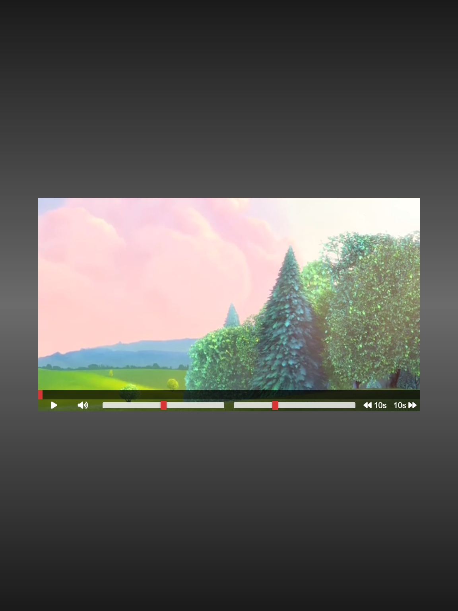

# Custom HTML Video Player

A fully functional, custom HTML video player with interactive controls, including volume, playback speed, and skip buttons. The player offers a clean, responsive design and smooth interactivity for a modern video viewing experience.

## Description

This project is a custom-built HTML video player that includes a variety of interactive controls for playback. It features a play/pause button, volume control with mute functionality, adjustable playback speed, and skip buttons for navigating within the video. The player is built using HTML, CSS, and JavaScript, offering a responsive design optimized for both mobile and desktop viewing. The layout is handled with Flexbox, and the controls offer intuitive interactions with smooth animations.

## Features

- Custom video player built with HTML5 `<video>` element.
- Play/pause button with an icon that toggles dynamically.
- Volume control with a mute/unmute button and range slider.
- Playback speed control via a range slider.
- Skip buttons to move forward or backward by 10 seconds.
- Smooth transition effects for video controls and progress bar.
- Volume adjustment automatically triggers mute/unmute icon updates.
- Responsive design for both mobile and desktop devices.
- Built using modern JavaScript to control video interactions.

## Technologies Used

- HTML
- CSS
- JavaScript
- Font Awesome (for icons)

## How to Run

1. Clone the repository to your local machine.
2. Open `index.html` in your web browser to start the video player.
3. Alternatively, you can view the live project on GitHub Pages: [Custom Video Player on GitHub Pages](https://deannamandarino.github.io/custom-video-player/).

## Acknowledgments

This project was completed as part of the JavaScript30 course. Special thanks to Wes Bos for the excellent resources and guidance throughout the course.